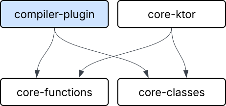

<!-- _class: title -->

# Lightweight RPC for Kotlin Multiplatform

### Master Thesis

Student: Aleksandr Stupnikov
Actual supervisor: Ilmir Usmanov
Supervisor: Anton Podkopaev

---

# Problem Statement and Motivation

Kotlin used for **network-heavy shared codebase** software
* Client-server apps, microservices, distributed networks
  * Business logic — unique
  * Network code — repetitive, **boilerplate**
* Client, server, multiple microservices in one project
</br>

**Problem:** network part is too big

---

# Kotlin network technologies

* Ktor
* gRPC
* Kotlin RPC (kRPC)

---

# Ktor Boilerplate

- Routing logic
- Serialization and deserialization
- HTTP client calls
- Error handling and status codes

Gives **fine control**, but is unnecessary in **shared codebase**

---

# kRPC and gRPC Boilerplate

```kotlin
@Rpc interface PizzaShop {
    suspend fun orderPizza(pizza: Pizza): Receipt
}

class PizzaShopImpl : PizzaShop {
    override suspend fun orderPizza(pizza: Pizza): Receipt { .. }
}

val pizzaShop = client.withService<PizzaShop>()
pizzaShop.orderPizza(Pizza("Pepperoni"))
```

**Drawbacks:**
1. Declare and implement an interface just for remote functions
1. Top-level functions cannot be called remotely
1. Remote calls are invisible at the call site


---

# Goals and Objectives

**Goal:** Develop RPC framework for Kotlin Multiplatform shared-codebase projects that reduces boilerplate compared to existing approaches

**Objectives:**
1. Prototype RPC framework using **context parameters**
2. Prototype support for distributed objects
3. Implement as Kotlin compiler plugin with runtime library
4. Evaluate by comparing with alternatives on example projects

---

# Background — Context Parameters

* Experimental Kotlin feature
* Implicit function parameters resolved from enclosing scope
* Express environmental requirements in type system

```kotlin
context(logger: Logger)
fun greet(name: String) {
    logger.info("Hello, $name")
}

fun main() {
    val logger = Logger()
    context(logger) {     // or with(logger)
        greet("World")    // logger is passed implicitly
    }
}
```

---

# Context Parameters for RPC

Context parameters to carry **remote execution configuration** implicitly:

```kotlin
@Remote
context(ctx: RemoteContext<RemoteConfig>)
suspend fun multiply(lhs: Long, rhs: Long): Long
```

- Determines where the function executes (locally or remotely)
- Describes how to remotely execute the function
- Visible at the type level and at call side

---

# RemoteContext Implememntation

```kotlin
sealed interface RemoteContext<out T : RemoteConfig>
object LocalContext : RemoteContext<Nothing>
class ConfiguredContext<T : RemoteConfig>(val config: T) : RemoteContext<T>
```

<!-- - `Nothing` is Kotlin's bottom type → subtype of every type
- `out T` (covariance) → `RemoteContext<Nothing>` subtypes `RemoteContext<T>` for **all** `T` -->
- Remote functions can be called in `LocalContext` or `ConfiguredContext<T>`
- `LocalContext` — original body executes locally
- `ConfiguredContext<T: RemoteConfig>` — network query using `T`

---

# How It Looks to the User

```kotlin
@Remote
context(_: RemoteContext<RemoteConfig>)
suspend fun multiply(lhs: Long, rhs: Long) = lhs * rhs
```

**Client call:**
```kotlin
fun main() = runBlocking {
    context(ConfiguredContext(ServerConfig("localhost:8080"))) {
        println(multiply(6, 7)) // remote call over HTTP
    }
}
```

**Server call (inside internal lib):**
```kotlin
context(LocalContext) { multiply(6, 7) }
```

---

# What Compiler Plugin Generates

<!-- `@Remote` annotation triggers a **body transformation** via IR plugin: -->

**User writes:**
```kotlin
@Remote
context(_: RemoteContext<RemoteConfig>)
suspend fun multiply(lhs: Long, rhs: Long) = lhs * rhs
```

**Plugin generates:**
```kotlin
context(ctx: RemoteContext<RemoteConfig>)
suspend fun multiply(lhs: Long, rhs: Long) =
    if (ctx is LocalContext) {
        lhs * rhs // original body
    } else {
        (ctx as ConfiguredContext<RemoteConfig>).config.client.call<Long>(
            RemoteCall("multiply", arrayOf(lhs, rhs))
        )
    }
```

---

# RemoteSerializable classes — Distributed Objects

```kotlin
@RemoteSerializable
class Calculator(private var state: Int) {
    @Remote context(_: RemoteContext<RemoteConfig>)
    suspend fun multiply(x: Int): Int { state *= x; return state }

    companion object {
        @Remote context(_: RemoteContext<RemoteConfig>)
        suspend operator fun invoke(init: Int) = Calculator(init)
    }
}
```

```kotlin
ServerConfig.runWith {
    val calc = Calculator(5)    // created on server, stub returned
    calc.multiply(6)            // method runs on server, state preserved
    calc.multiply(7)            // state = 5 * 6 * 7 = 210
}
```

---

# Ktor Integration

Framework is **transport-agnostic**, but Ktor integration is provided out of the box

```kotlin
embeddedServer(Netty, port = 8080) {
    install(KRemote) { callableMap = genCallableMap() }
    routing {
        remote("/call")
    }
}.start()
```

Authentication, logging, CORS, rate limiting — all standard Ktor features work

---

# Kotlin Remote module structure
</br>
<center>
    
</center>

---

# Feature Comparison

| Feature                        | **gRPC**       | **Kotlin RPC**   | **Kotlin Remote**         |
| ------------------------------ | -------------- | ---------------- | ------------------------- |
| Service interface required     | Yes (IDL)      | Yes (`@Rpc`)     | No                        |
| Top-level functions            | No             | No               | Yes                       |
| Remoteness marked at call site | No             | No               | Enclosing `context` block |
| Hierarchical context tiers     | No             | No               | Yes                       |
| Stateful remote objects        | No             | No               | Yes                       |
| Streaming                      | Yes            | Yes              | No                        |
| Kotlin Multiplatform support   | Limited        | Yes              | Yes                       |
| Cross-language                 | Yes            | No               | No                        |
| Transport                      | HTTP/2 (fixed) | Pluggable (Ktor) | Pluggable (Ktor)          |

---

# Example Applications

Written **twice** — once with Kotlin Remote, once with Kotlin RPC:

- **Todo** (4 operations) — CRUD app; baselines per-application setup cost
- **Rooms chat** (9 operations) — peer-to-peer chat; exercises distributed objects
- **Social platform** (36 operations) — 10 microservices backend; stresses per-microservice overhead and orchestration
- **CMS** (14 operations) — content management system with 4 hierarchical context tiers and Ktor basic authentication; exercises hierarchical contexts

---

# Framework-Specific Code per Application

| Application                     | Kotlin Remote | Kotlin RPC | Boilerplate reduction |
| ------------------------------- | ------------- | ---------- | --------------------- |
| Todo (4 ops)                    | 12            | 12         | 0%                    |
| Social platform (36 remote ops) | 89            | 136        | 35%                   |
| CMS (14 remote ops)             | 44            | 55         | 20%                   |

* Lines counted by IR traversal over both codebases
  * @Rpc interfaces, implementations, stubs creation
  * context parameters, @Remote annotations, config definitions, context switches
* Similar boilerplate on small apps
* Much less boilerplate on larger apps

---

# Boilerplate example

<div class="columns">
<div>

**Kotlin Remote**

```kotlin
@Remote context(_: RemoteContext<UsersService>)
suspend fun getUser(id: Long): User = dep<UserRepository>().get(id)

@Remote context(_: RemoteContext<PostsService>)
suspend fun postWithAuthor(postId: Long) = UsersService.runWith {
    val post = dep<PostRepository>().get(postId)
    PostWithAuthor(post, getUser(post.authorId))
}
```
</div>
<div>

**Kotlin RPC**

```kotlin
@Rpc interface UsersService {
    suspend fun getUser(id: Long): User
}

@Rpc interface PostsService {
    suspend fun postWithAuthor(postId: Long): PostWithAuthor
}

class UsersServiceImpl : UsersService {
    override suspend fun getUser(id: Long) = userRepo.get(id)
}

class PostsServiceImpl(private val users: UsersService) : PostsService {
    override suspend fun postWithAuthor(postId: Long): PostWithAuthor {
        val post = dep<PostRepository>().get(postId)
        return PostWithAuthor(post, users.getUser(post.authorId))
    }
}
```
</div>
</div>

---

# Performance Comparison

* Per-Call Latency
* Local Dispatch overhead
* Distributed garbage collection performance
* Artifact size

**Result:** No significant differences with Kotlin RPC

---

# Limitations

- Narrow scope of application
- Dependency on experimental Kotlin features

---

# Future work

- Code slicing
- Streaming
- Remote lambdas

---

# Summary

1. Developed **Kotlin Remote** — RPC framework that uses context parameters for remote calls
2. Tiers and remote objects support, remote calls visible at call site
3. Boilerplate reduction vs Kotlin RPC:
   - Social platform (36 ops): **35% less** framework code
   - CMS (14 ops): **20% less** framework code
   - Todo (4 ops): **tied**
4. No performance degradation

---

---

# Kotlin network technologies

* Ktor
* gRPC
* Kotlin RPC

---

# KMP support

No reflection on KMP → need to gather remote functions metadata statically

The plugin replaces `genCallableMap()` intrinsic calls with metadata collected at compile time:

```kotlin
// User writes:
val map = genCallableMap()

// Plugin replaces with:
val map = CallableMap(
    "pkg.multiply" to RemoteCallable(
        returnType  = typeOf<Long>(),
        parameters  = arrayOf(typeOf<Long>(), typeOf<Long>()),
        invokator   = { args -> multiply(args[0] as Long, args[1] as Long) }
    ),
    // ... entry for every @Remote function in the source
)
```

No reflection needed — works on **all KMP targets** (JVM, JS, Native, Wasm).

---

# Remote Classes — How It Works

<div class="columns">
<div>

**Serialization:**
- Real instance stored in `RemoteInstancesPool` on the server
- Client receives a *stub* (just ID + URL)
- Stub is a generated subclass

</div>
<div>

**Invocation:**
- Method call on stub triggers remote call
- Server looks up real instance by ID
- Executes method on the real object

</div>
</div>

**Garbage Collection:**
- Lease-based: client periodically renews leases for held stubs
- When leases expire, server removes instance from pool
- Uses weak references to detect when client drops stubs

---

# Todo App — Kotlin Remote

**4 CRUD operations, H2 database, Ktor server**

```kotlin
@Remote
context(_: RemoteContext<ServerConfig>)
suspend fun createTodo(request: CreateTodoRequest): Todo =
    Dependencies.repository.create(request)

@Remote
context(_: RemoteContext<ServerConfig>)
suspend fun updateTodo(id: Long, request: UpdateTodoRequest): Todo =
    Dependencies.repository.update(id, request)

@Remote
context(_: RemoteContext<ServerConfig>)
suspend fun deleteTodo(id: Long) = Dependencies.repository.delete(id)

@Remote
context(_: RemoteContext<ServerConfig>)
suspend fun todos(): List<Todo> = Dependencies.repository.readAll()
```

---

# Client and Server Setup

<div class="columns">
<div>

**Client**

```kotlin
object ServerConfig : RemoteConfig {
    override val client = HttpClient {
        defaultRequest {
            url("http://localhost:8080")
        }
        install(ContentNegotiation) {
            json()
        }
    }.remoteClient(genCallableMap(), "/call")
}

fun main() = runBlocking {
    context(ServerConfig.asContext()) {
        println(multiply(6, 7)) // remote
    }
}
```

</div>
<div>

**Server**

```kotlin
fun main() {
    embeddedServer(Netty, port = 8080) {
        install(KRemote) {
            callableMap = genCallableMap()
        }
        routing {
            remote("/call")
        }
    }.start(wait = true)
}
```

`genCallableMap()` — compiler intrinsic, replaced at compile time with metadata for all `@Remote` functions

</div>
</div>


---

# What Functions Can Be Remote?

The framework supports a wide range of function kinds:

- **Top-level functions** — `suspend fun multiply(a: Long, b: Long)`
- **Extension functions** — `suspend fun Long.times(rhs: Long)`
- **Class methods** — instance and companion object
- **Nested / local functions** — declared inside other functions
- **Generic functions** — with serializable upper bounds
- **Recursive functions** — recursive calls execute locally
- **Functions that throw** — exceptions propagated transparently


---

# Exception Handling

Remote exceptions are **transparently propagated** to the client:

```kotlin
@Remote context(_: RemoteContext<RemoteConfig>)
suspend fun div(x: Int, y: Int) = x / y

fun main() = runBlocking {
    try {
        ServerConfig.runWith { div(10, 0) }
    } catch (e: ArithmeticException) {
        e.printStackTrace()
    }
}
```

```
java.lang.ArithmeticException: / by zero
    at ExceptionKt.div(Exception.kt:11)
    at == Remote Call Boundary ==.(Unknown Source)    ← synthetic frame
    at ExceptionKt.main(Exception.kt:15)
```

---

# Context Hierarchy — Server Capabilities

Contexts form a **subtype hierarchy** expressing server capabilities:

```kotlin
interface ArithmeticConfig : RemoteConfig        // basic math
interface TrigonometricConfig : ArithmeticConfig // extends with trigonometry

@Remote context(_: RemoteContext<ArithmeticConfig>)
suspend infix fun Double.mul(rhs: Double) = this * rhs

@Remote context(_: RemoteContext<TrigonometricConfig>)
suspend fun sin(x: Double): Double {
    // can call mul() — ArithmeticConfig is a supertype
    // when on the server: mul() runs locally (LocalContext)
    ...
}
```

Type system enforces which functions are callable from where.

---

# Compiler Plugin — Technical Details

<div class="columns">
<div>

**FIR (Frontend)**
- Checker: `@Remote` must have `RemoteContext` context param and be `suspend`
- Generator: stub subclass for `@RemoteSerializable`
- Errors visible in IntelliJ IDEA

</div>
<div>

**IR (Backend)**
- `RemoteFunctionBodyTransformer` — rewrites bodies
- `CallableMapGenerator` — replaces `genCallableMap()` calls
- `RemoteClassListGenerator` — replaces `genRemoteClassList()` calls

</div>
</div>

---

# Background — Coeffects

**Coeffects** — a type-system mechanism for tracking how computations *depend on their environment*.

- Dual of *effects*: effects describe what a computation **does**, coeffects describe what it **requires**
- Implemented via *indexed comonads* in theory
- Practically expressible as *implicit parameters*

> A remote function *requires* a way to reach a remote machine — this is a **coeffect**.

---

# Background — Functional RPC (Servant in Haskell)

```haskell
position :: Int -> Int -> ClientM Position        -- remote procedure
hello    :: Maybe String -> ClientM HelloMessage  -- remote procedure

queries :: ClientM (Position, HelloMessage)
queries = do
  pos     <- position 10 10
  message <- hello (Just "servant")
  return (pos, message)

run :: IO ()
run = do
  Right (pos, message) <- runClientM queries ... "localhost"
  print pos
